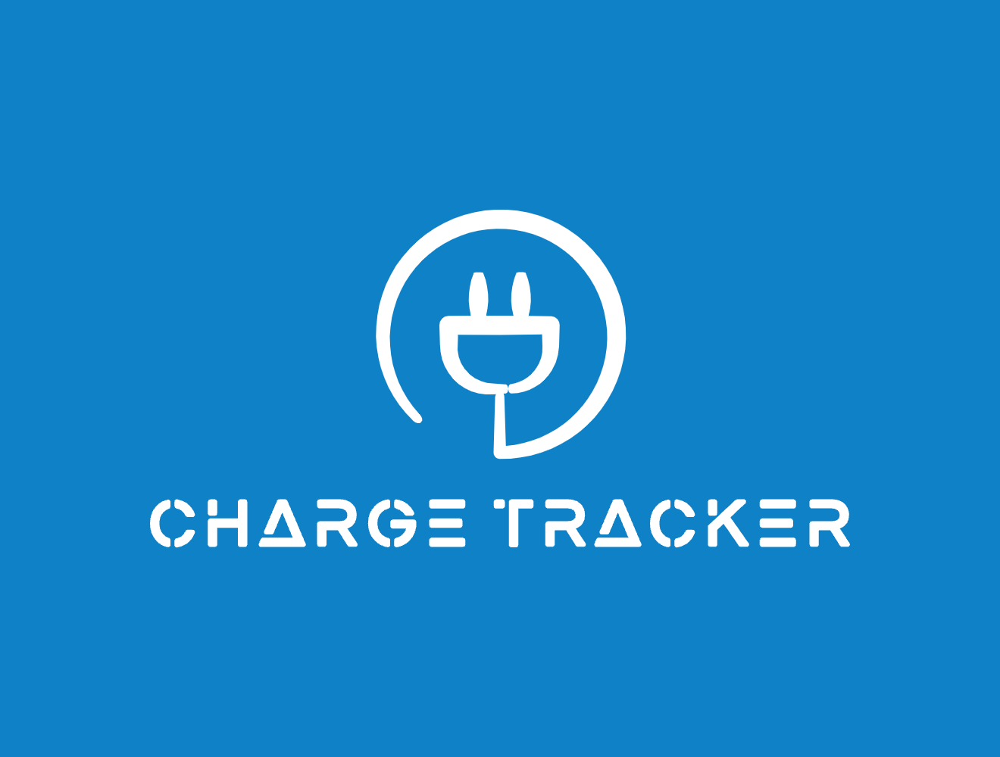

# ⚡ Charge Tracker

Charge Tracker is a mobile application built with [React Native](https://reactnative.dev/) and [Expo](https://expo.dev/) that helps EV users find, check in to, and review charging stations across Australia.

<div align="center">
  
</div>

---

## Features

- Search for EV charging stations by area or current location
- View station details including live availability, rating, and plug types
- Check in / check out of docks in real-time
- Leave reviews with rating, comment, plug type, and wait time
- Profile image support for user reviews
- Fully responsive UI, designed for mobile experience

## Get started

1. Install dependencies

   ```bash
   npm install
   ```

2. Start the app

   ```bash
    npx expo start
   ```

In the output, you'll find options to open the app in a

- [development build](https://docs.expo.dev/develop/development-builds/introduction/)
- [Android emulator](https://docs.expo.dev/workflow/android-studio-emulator/)
- [iOS simulator](https://docs.expo.dev/workflow/ios-simulator/)
- [Expo Go](https://expo.dev/go), a limited sandbox for trying out app development with Expo

## Technologies Used

- Expo
- React Native
- Firebase Firestore
- Firebase Auth
- Firebase Storage
- React Native Maps
- Expo Location

## Team Members

- Peter Edwards
- Mark Prado
- Jamie Norton

